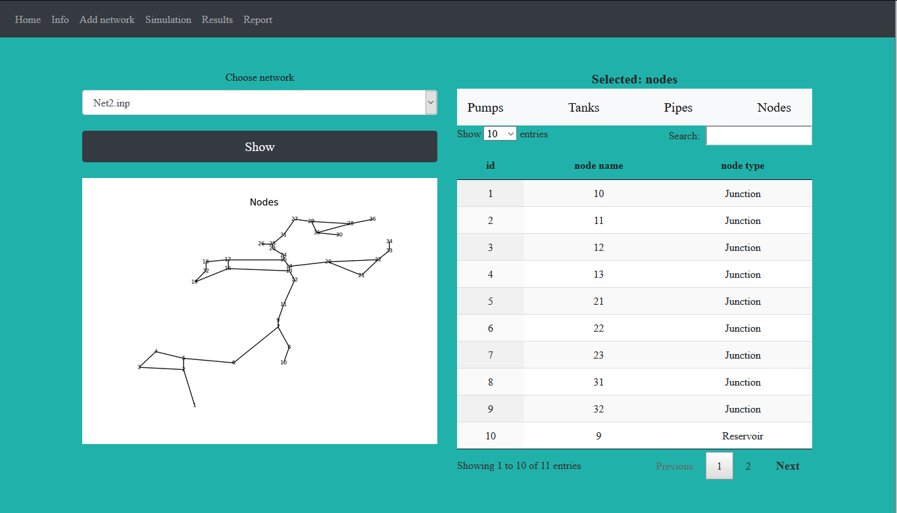
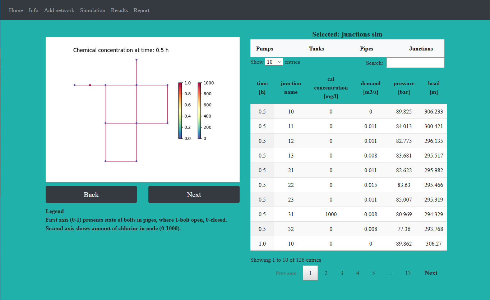
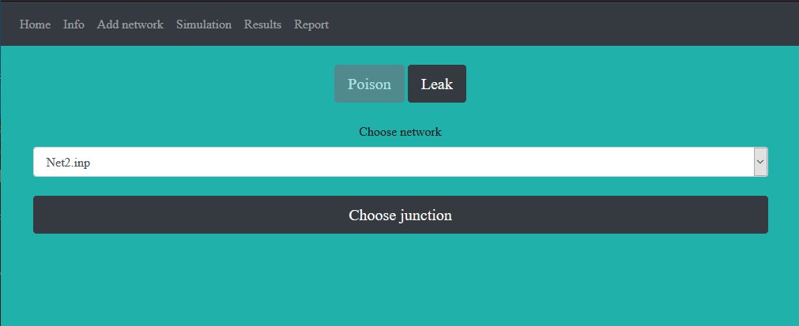
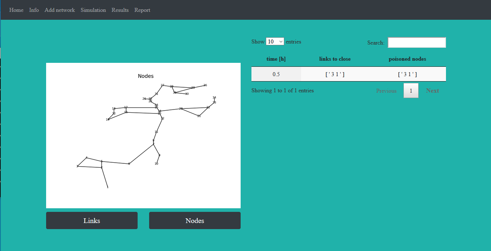

# Water Safety Flask App
Web App uses Python Flask, Bootstrap, some JS, jQuery and presents water supply network diagrams, results of simulating poison in water supply network. App is connected with sqlite database, currently some features such as adding an .inp model of network, running a simulation doesn't work, because of additional software needed.

## Requirements
* Python
* Flask
* sqlite3
* WNTR

## Showcase
 
 
 
 
 
 ## Usage
 Info shows water supply network diagram, which can be changed from the drop down menu (select network model and click on button 'Show'). Datatable on the right presents data about network from the database. By clicking on the navbar over the table, data and the diagram (2 types: links and nodes) can be changed. After choosing add network water network model can be send to server (currently disabled). After choosing option simulation possible is run simulation, possible options to choose are model of water network, simulation time, time and source of poisoning (running simulation is currently disabled). Option results shows chart from simulation step which can be changed by buttons below. After changing overlap to report in the table are shown links which should be closed in the appropriate time and poisoned nodes.
